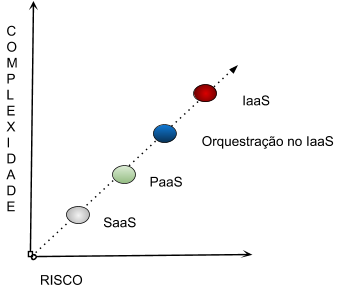

# Cloud

## Cloud e uma perspectiva arquitetural entre risco e serviços

Com essas facilidades um ponto importante é que os recursos de computação estão divididos entre os serviços. A melhor maneira de pensar no cloud em termo de abstração para o negócio, certamente é na analogia de uma pizza como serviço. Do qual temos a opção de fazer tudo em casa e ter que gerenciar todo o processo ou, sair para comer uma pizza e não se preocupar com nada.

Um ponto importante quando nós falamos do cloud e seus serviços é que quanto menor a abstração que utilizamos como serviço, por exemplo, o IaaS teremos a maior responsabilidade no processo de construção do software. Esse grande número de processos crescerá na mesma medida que o número de servidores e essa complexidade está relacionada aos riscos. 

* **IaaS**: Com ele será possível realizar todas os benefícios do cloud, que foram citados acima, porém, toda a responsabilidade de manutenção ficará para a nossa equipe. Garantir a comunicação certa entre os serviços para os respectivos banco de dados, o backup, o escalonamento tanto vertical quanto horizontal, etc. Todos esses pontos geram complexidade e por sua vez, mais risco.
	* Um bom exemplo de IaaS é o [Amazon EC2](https://aws.amazon.com/ec2/). De uma maneira geral, se pode pensar nele como sendo um grande aluguel de máquinas no qual se pode pagar pelo uso delas, semelhante a nossa conta de luz. Para ilustrar isso, vamos analisar a realização do deploy de uma aplicação com container na Amazon. O primeiro passo é a criação de [uma instância que são cerca de sete passos](https://docs.aws.amazon.com/AWSEC2/latest/UserGuide/launching-instance.html). Em seguida, a [instalação do Docker](https://docs.aws.amazon.com/AmazonECS/latest/developerguide/docker-basics.html), para que assim seja possível criar [uma imagem para executar essa instância](https://docs.aws.amazon.com/AmazonECS/latest/developerguide/docker-basics.html#docker-basics-create-image). É possível ver que um simples deploy de uma aplicação, requer vários passos.

* **Orquestração no IaaS**: Orquestração é a configuração, o gerenciamento e a coordenação automatizada dos serviços, aplicações e sistemas de computador. Ela tem com o objetivo de facilitar e abstrair o IaaS, fazendo com que fique mais próximo de um PaaS.
	* [Kubernetes](https://kubernetes.io/): É uma ferramenta open source de orquestração de container e trabalha muito bem com o [Docker](https://www.docker.com/). Atualmente, é uma das ferramentas mais populares. Como já sabemos não existem uma solução simples para um problema complexo no mundo da arquitetura de software. O que existe é uma coleção de [histórias de terror relacionada a experiência com o Kubernetes](https://github.com/hjacobs/kubernetes-failure-stories). Um ponto importante é que [só porque a ferramenta é popular não quer dizer que ela seja a melhor opção para nós](https://pythonspeed.com/articles/dont-need-kubernetes/). Ou seja, mesmo sendo uma abstração dentro da infraestrutura como serviço, o Kubernetes não é uma solução simples e existem diversos riscos com a infraestrutura que devem ser considerados.

* **PaaS**: Redução drástica de complexidade para focar na criação do software, certamente, é a maior vantagem dentro do PaaS. Com ele, no geral, não é necessário se preocupar com a manutenção das máquinas, criação de rotina de backup, compra de licenças, etc. Todo os cuidados do [desenvolvimento será na criação do software](https://twitter.com/gilzow/status/1251308583427465216). Porém, o PaaS tem um custo mais elevado comparado com os serviços sem maior abstração.
  *  Platform.sh: É um PaaS que utiliza todos os conceitos de infraestrutura como serviço e também é orientado ao Git, além de ser possível realizar o deploy da aplicação deixando todo trabalho para a plataforma. Basicamente, a partir de três arquivos: [aplicação](https://docs.platform.sh/configuration/app-containers.html), [serviços](https://docs.platform.sh/configuration/services.html) e [rotas](https://docs.platform.sh/configuration/routes.html) podemos fazer o push para um repositório Git. Um simples push para o sistema remoto do Platform.sh criará automaticamente os containers da aplicação, dos serviços como banco de dados e as rotas da aplicação. Nesse caso a abstração é gigantesca e faz com que o time foque muito mais na aplicação central da empresa.
* **SaaS**: O Software como serviço é um programa pronto para uso do qual não se preocupa com hospedagem, escalabilidade, etc. Toda a complexidade e o risco já foram resolvidos. No entanto, a customização está reduzida e a possibilidade de configuração depende diretamente do provedor.

De uma maneira geral temos que pensar nos seguintes três princípios cíclicos que compara:

* Quanto maior a complexidade menor abstração;
* Quanto maior abstração menor é o risco;
* Quanto menor o risco menor é complexidade.
  

É verdade que existem vários benefícios na navegação nos mares da computação em nuvem, porém, é muito importante conhecer os tipos de serviços que a cloud disponibiliza e fazer uma análise profunda entre a complexidade de um serviço com o seu respectivo risco, além de quanto tempo o time está disposto a gastar para criar e manter toda a infraestrutura. o PaaS fornece uma grande vantagem de abstração de toda a infraestrutura e manutenção para que o desenvolvedor foque no seu negócio.O IaaS te garantirá uma grande flexibilidade e poder para instalar e configurar o que seu time deseja sem nenhum problema mesmo que tudo tenha que seja configurado manualmente. É muito importante que a quanto o time quanto a empresa tenha noção de que, independente da escolha haverão benefícios e desvantagens. É muito importante para que os arquitetos avaliem o que melhor se encaixa na instituição, afinal, cloud e computação não está relacionado a quando, mas como.