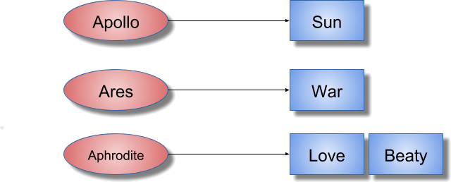
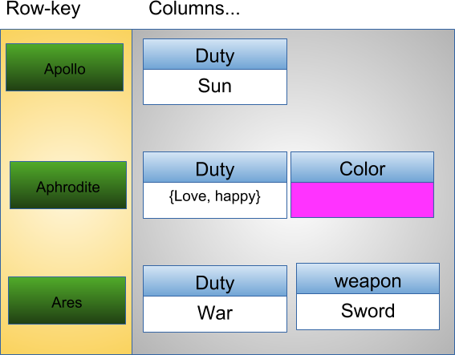
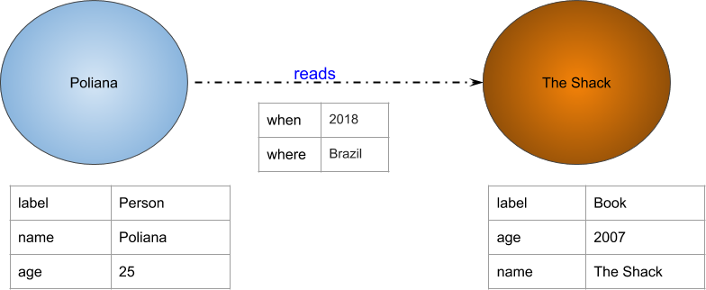

# NoSQL vs. SQL

Muitas das vezes em que tocamos nesse ponto, discussões acaloradas podem surgir! Principalmente por que muita gente acredita que isso realmente é uma guerra, uma rixa, etc., quando na verdade não é isso.

Vamos a um pouquinho de história e veremos mais detalhes sobre o NoSQL e suas diferenças para o SQL.

Como tudo no universo da tecnologia, procuramos sempre criar algo para resolver um problema. No contexto dos bancos de dados, quando eles nasceram há mais de 40 anos, havia um problema: os dados produzidos pelos computadores da época deveriam ficar armazenados e não poderiam ser perdidos quando as máquinas fossem desligadas, para que pudessem ser utilizados posteriormente. Porém, naquela época, a tecnologia de armazenamento estava engatinhando e discos eram muito caros. Por isso surgiu a necessidade de se estruturar e normalizar os dados que seriam gravados nesses discos. Assim, os dados armazenados utilizariam menos espaço e, consequentemente, teriam um aproveitamento melhor de recursos, gerando economia ou a possibilidade de se armazenar mais dados em um mesmo espaço. Nesse contexto, os bancos de dados relacionais foram criados, com todos os conceitos que você já viu no módulo anterior, como formas normais e estrutura de dados bem definidas.

O tempo passou, nossa tecnologia evoluiu e, com essa evolução, mais um problema surgiu: produzimos dados em uma quantidade muito grande, muitas vezes de forma desestruturada e também descentralizada com sistemas cada vez mais distribuídos. Esses dados são chamados de desestruturados por terem origem em diversas fontes, como sensores IOT (_Internet of Things_, como uma geladeira conectada à internet, relógios inteligentes e carros autônomos), imagens e documentos não catalogados etc. Estruturar, isto é, organizar essas fontes é possível, porém requer muito tempo e, com isso, as aplicações podem perder o *timing* de entrega das soluções. Esse problema precisava ser resolvido e, assim, nasceram os bancos de dados NoSQL!

O termo **NoSQL** foi originalmente criado em 1998 por Carlo Strozzi e posteriormente re-introduzido por Eric Evans em 2009, quando participou da organização de um evento para discutir bancos de dados **open source** e **distribuídos**. Por falar em distribuídos, esse é um conceito amplamente utilizado pelos bancos NoSQL: basicamente, esses são bancos operando em computação distribuída, um conceito que aumenta muito sua escalabilidade e performance. Veja um pouco mais sobre computação distribuída [aqui](https://imasters.com.br/arquitetura-da-informacao/paradigma-da-computacao-distribuida).

### O que significa NoSQL?

Não existe uma definição, digamos, "oficial" para o que realmente esse termo significa, mas particularmente gosto da seguinte: **N**ot **O**nly **SQL**, ou seja, "Não Somente SQL". Essa definição enfatiza que esses bancos podem utilizar linguagens semelhantes ao [SQL ANSI](https://pt.wikipedia.org/wiki/SQL) para realizar consultas e demais operações, e não somente o SQL em si.

### Particularidades do NoSQL

Quando você estudou sobre bancos de dados relacionais, viu que esses bancos são baseados no conceito **ACID (Atomicity, Consistency, Isolation, Durability)**. Os bancos de dados NoSQL, em sua grande maioria, baseiam-se em um outro conceito: o **BASE (Base Availability, Soft State and Eventually Consistent)**.

Antes de detalhar cada ponto do conceito **BASE**, você precisa entender um termo importante que verá ao longo deste módulo: **cluster**. Um cluster, no contexto de banco de dados, se refere à capacidade de um conjunto de **servidores** ou **instâncias** se conectarem a um banco de dados. Uma **instância** é uma coleção de memória e processos que interagem com o banco de dados, que é o conjunto de arquivos físicos que realmente armazenam os dados.

O cluster oferece duas vantagens principais, especialmente em ambientes de banco de dados de alto volume:

* **Tolerância a falhas** (_Fault Tolerance_): como há mais de um servidor ou instância para os usuários se conectarem, o cluster oferece uma alternativa no caso de falha em um servidor. Quando se lida com dezenas de milhares de máquinas em um único [_data center_](https://pt.wikipedia.org/wiki/Centro_de_processamento_de_dados), tais falhas são um problema presente;

* **Balanceamento de carga** (_Load Balancing_): o cluster geralmente é configurado para permitir que os usuários sejam automaticamente alocados ao servidor com o mínimo de uso para que, assim, se otimize o uso da estrutura disponível para o banco.

### Detalhando o conceito BASE

- `Base Availability` - **BA**
    - O banco de dados aparenta funcionar o tempo todo. Como existe o conceito de cluster, se um servidor falhar, o banco continuará funcionando por conta de outro servidor que suprirá essa falha;

- `Soft State` - **S**
    - Não precisa estar consistente o tempo todo. Ou seja: com um banco distribuído em várias máquinas e todas sendo usadas com igual frequência para escrita e consulta, é possível que, em dado momento, uma máquina receba uma escrita e não tenha tido tempo de "repassar" essa escrita para as demais máquinas do banco. Assim, se um usuário consultar a máquina que já foi atualizada e  outro o fizer numa máquina menos atualizada os resultados, que deveriam ser iguais, serão diferentes. Imagine a sua _timeline_ do **Facebook**: nela são exibidos os posts de seus amigos, porém nem todos os posts são exibidos exatamente ao mesmo tempo. Nesse caso, o que acontece é que a informação foi enviada ao banco de dados, mas nem todos os servidores do cluster têm essa mesma informação ao mesmo tempo. Isso permite que o banco de dados possa gerenciar mais informações de escrita sem ter que se preocupar em replicá-las em uma mesma operação;

- `Eventually Consistent` - **E**
    - O sistema se torna consistente em algum momento. Como não temos a informação replicada "instantaneamente", esse ponto se encarrega de deixar o banco consistente "ao seu tempo". Isso porque, dependendo das configurações do cluster, essa replicação pode acontecer mais rapidamente ou não. Mas em algum momento as informações estarão consistentes e presentes em todos os servidores do cluster.

Uma outra característica marcante é a ausência de *schema* ou *schema* flexível. Isso quer dizer que não há necessidade de definição prévia do schema dos dados. Se por um lado isso torna muito mais dinâmico o processo de inclusão de novos atributos, por outro pode impactar a integridade desses dados. Não se preocupe: a seu tempo, todos esses conceitos ficarão bem mais claros.

---

## NoSQL e suas classes

Os bancos de dados NoSQL estão divididos em 4 principais tipos (que no contexto de banco de dados, são chamados de **classes**):

* Chave / Valor - *Key / Value*
* Família de Colunas - *Column Family*
* Documentos - *Document*
* Grafos - *Graph*

Cada uma desses classes tem aplicações diferentes e devemos sempre observar as características da classe para tirar o melhor proveito dela.

### *Key / Value*

Os bancos do tipo chave-valor possuem uma estrutura similar ao `java.util.Map`, ou seja, a informação será recuperada apenas pela chave. Esse tipo de banco de dados pode ser utilizado, por exemplo, para gerenciar a sessão do usuário. Outro caso interessante é o DNS, cuja chave é o endereço, por exemplo, `www.google.com` e o valor é o IP desse servidor.

Atualmente existem diversas implementações de banco de dados do tipo chave-valor, dentre os quais os mais famosos são:

* AmazonDynamo
* AmazonS3
* Redis
* Scalaris
* Voldemort

Comparando o banco de dados relacional com o do tipo chave-valor, é possível perceber alguns pontos. O primeiro é que a estrutura do chave-valor é bastante simples. Não é possível realizar operações como `join` entre os `buckets` e o valor é composto por grande bloco de informação em vez de ser subdivido em colunas como na base de dados relacional.

| Estrutura relacional | Estrutura chave-valor |
| -------------------- | --------------------- |
| Table                | Bucket                |
| Row                  | Key/value pair        |
| Column               | ----                  |
| Relationship         | ----                  |

### *Column Family*

Esse modelo se tornou popular através do _paper BigTable_ do Google, com o objetivo de montar um sistema de armazenamento de dados distribuído, projetado para ter um alto grau de escalabilidade e de volume de dados. Assim como o chave-valor, para realizar uma busca ou recuperar alguma informação dentro do banco de dados é necessário utilizar o campo que funciona como um identificador único que seria semelhante à chave na estrutura chave-valor. Porém, as semelhanças terminam por aí. As informações são agrupadas em colunas: uma unidade da informação que é composta pelo nome e a informação em si.

Esses tipos de bancos de dados são importantes quando se lidam com um alto grau de volume de dados, de modo que seja necessário distribuir as informações entre diversos servidores. Mas vale salientar que a sua operação de leitura é bastante limitada, semelhante ao chave-valor, pois a busca da informação é definida a partir de um campo único ou uma chave. Existem diversos bancos de dados que utilizam essas estruturas, por exemplo:

* Hbase
* Cassandra
* Scylla
* Clouddata
* SimpleDb
* DynamoDB

Dentre os tipos de bancos de dados do tipo família de coluna, o Apache Cassandra é o mais famoso. Assim, caso uma aplicação necessite lidar com um grande volume de dados e com fácil escalabilidade, o Cassandra é certamente uma boa opção.

Ao contrapor o banco do tipo família de coluna com os bancos relacionais, é possível perceber que as operações, em geral, são muito mais rápidas. É mais simples trabalhar com grandes volumes de informações e servidores distribuídos em todo o mundo, porém, isso tem um custo: a leitura desse tipo de banco de dados é bem limitada. Por exemplo, não é possível realizar uniões entre família de colunas como no banco relacional. A família de coluna permite que se tenha um número ilimitado de coluna, que por sua vez é composta por nome e a informação, exatamente como mostra a tabela a seguir:

| Estrutura relacional | Estrutura de família de colunas |
| -------------------- | ------------------------------- |
| Table                | Column Family                   |
| Row                  | Column                          |
| Column               | nome e valor da Column          |
| Relacionamento       | Não tem suporte                 |

### Documentos - *Document*

Os bancos de dados orientados a documento têm sua estrutura muito semelhante a um arquivo JSON ou XML. Eles são composto por um grande número de campos, que são criados em tempo de execução, gerando uma grande flexibilidade, tanto para a leitura como para escrita da informação. 

Eles permitem que seja realizada a leitura da informação por campos que não sejam a chave. Algumas implementações, por exemplo, têm uma altíssima integração com motores de busca. Assim, esse tipo de banco de dados é crucial quando se realiza análise de dados ou logs de um sistema. Existem algumas implementações dos bancos de dados do tipo documento, sendo que o mais famoso é o MongoDB.

* AmazonSimpleDb
* ApacheCouchdb
* MongoDb
* Riak

Ao comparar com uma base relacional, apesar de ser possível realizar uma busca por campos que não seja o identificador único, os bancos do tipo documentos não têm suporte a relacionamento. Outro ponto é que os bancos do tipo documento, no geral, são _schemeless_.

| Estrutura relacional | Estrutura de documentos |
| -------------------- | ----------------------- |
| Table                | Collection              |
| Row                  | Document                |
| Column               | Key/value pair          |
| Relationship         | --                      |

### Grafos - *Graph*

Os bancos do tipo grafos são uma estrutura de dados que conecta um conjunto de vértices através de um conjunto de arestas. Os bancos modernos dessa categoria suportam estruturas de grafo multirrelacionais, onde existem diferentes tipos de vértices (representando pessoas, lugares, itens) e diferentes tipos de arestas. Os sistemas de recomendação que acontecem em redes sociais são o maior case para o banco do tipo grafo. Dos tipos de banco de dados mais famosos no mundo NoSQL, o grafo possui uma estrutura distinta com o relacional. 

* Neo4j
* InfoGrid
* Sones
* HyperGraphDB